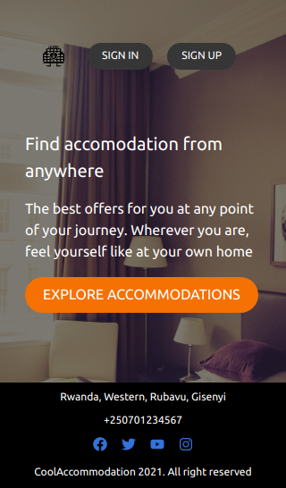

# Cool-accommodation-frontend

A frontend web app that allows users to browse houses and like or unlike them, build with React and Redux and connected to a backend API built with Rails. 

## 🔧 Built with

- React Js
- Redux
- Rails API
- axios

## Rails Back-End Project

Please find [Backend source codes](https://github.com/descholar-ceo/cool-accommodation)

## Project Screenshot

## Live Demo Link

[Link Demo](https://cool-accommodation.netlify.app/)

## Getting Started

To get a local copy of the repository please run the following commands on your terminal:

~~~bash
$ git clone https://github.com/descholar-ceo/cool-accommodation-frontend
$ cd cool-accommodation-frontend

~~~

To run on the local server

~~~bash
$ yarn start
~~~

Runs the app in the development mode.\
Open [http://localhost:3000](http://localhost:3000) to view it in the browser.

The page will reload if you make edits.\
You will also see any lint errors in the console.

👤 **Mugirase Emmanuel**

- Github: [@descholar-ceo](https://github.com/descholar-ceo)
- Twitter: [@descholar3](https://twitter.com/descholar3)
- Linkedin: [Mugirase Emmanuel](https://www.linkedin.com/in/mugirase-emmanuel/)

## 🤝 Contributing

Contributions, issues and feature requests are welcome!

Feel free to check the [issues page](https://github.com/descholar-ceo/cool-accommodation-frontend/issues).

## 👍 Show your support

Give a ⭐️ if you like this project!

## :clap: Acknowledgements

- Design Idea by: [Alexey Savitskiy](https://www.behance.net/gallery/37706679/Circle-(Landing-page-Dashboard-Mobile-App))

- Microverse: [@microverse](https://www.microverse.org/)
